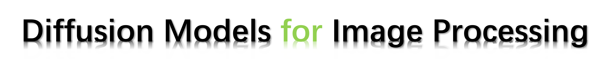

# Awesome-All-in-one-Image-Restoration-Methods
<p align="center">
  
</p>

A list of awesome all-in-one image restoration methods. Updating...!

Reference: Diffusion Models for Image Restoration and Enhancement--A Comprehensive Survey

Link: https://github.com/lixinustc/Awesome-diffusion-model-for-image-processing


**Purpose**: We aim to provide a summary of all-in-one image processing techniques, including restoration, enhancement, coding, and quality assessment. More papers will be summarized.

[Jiaqi Ma](https://scholar.google.com/citations?user=BJUlpoMAAAAJ&hl=zh-CN)<sup>1,✢</sup>, [Xu Zhang](https://scholar.google.com/citations?user=xDDy-DwAAAAJ&hl=zh-CN)<sup>1,✢</sup>, [Guoli Wang](https://scholar.google.com/citations?user=z-25fk0AAAAJ&hl=zh-CN)<sup>2,</sup>, [Qian Zhang](https://scholar.google.com/citations?user=pCY-bikAAAAJ&hl=zh-CN)<sup>2,</sup>, [Lefei Zhang](https://scholar.google.com/citations?user=BLKHwNwAAAAJ&hl=zh-CN)<sup>1,📧</sup>, [Bo Du](https://scholar.google.com/citations?user=Shy1gnMAAAAJ&hl=zh-CN)<sup>1</sup>, [Liangpei Zhang](https://scholar.google.com/citations?user=vzj2hcYAAAAJ&hl=zh-CN)<sup>1</sup>, [Dacheng Tao](https://scholar.google.com/citations?user=RwlJNLcAAAAJ&hl=zh-CN)<sup>3</sup>

<sup>1</sup> Wuhan University\
<sup>2</sup> Horizon Robotics\
<sup>3</sup> Nanyang Technological University

(✢) Equal contribution.
(📧) corresponding author.

**Brief intro**: The survey for all-in-one IR has been released.

<!-- [](https://arxiv.org/pdf/2308.09388v1.pdf)    -->

## 🔖 News!!!
- [x] 2024-04-25: **Updated new related works before 25/04/2024 in this GitHub.**
- [ ] 2024-06-25: **Updated new related works before 25/06/2024 in this GitHub.**

**📌 About new works.** If you want to incorporate your studies (e.g., the link of paper or project) on diffusion model-based image processing in this repository. Welcome to raise an issue or email us. We will incorporate it into this repository and our survey report ASAP. 


## 🌟  Features
- [x] **Survey for diffusion model-based Image Restoration** ([Arxiv version](https://arxiv.org/pdf/2308.09388v1.pdf) is released) 
- [x] **Summary for diffusion model-based Image/Video Compression**
- [x] **Summary for diffusion model-based Quality Assessment**


## Diffusion model-based Image Restoration/Enhancement
### Table of contents
<!-- - [Survey paper](#survey-paper)
- [Table of contents](#table-of-contents) -->
- [Diffusion model for Image Super resolution](#image-super-resolution)
- [Diffusion model for Image Restoration](#image-restoration)
- [Diffusion model for Image Inpainting](#image-inpainting)
- [Diffusion model for Image Shadow Removal](#image-shadow-removal)
- [Diffusion model for Image Denoising](#image-denoising)
- [Diffusion model for Image Dehazing](#image-dehazing)
- [Diffusion model for Image Deblurring](#image-deblurring)
- [Diffusion model for Medical IR](#medical-restoration-mrict)
- [Diffusion model for Low-Light Enchancement](#low-light-enchancement)
- [Diffusion model for other tasks](#other-tasks)
- [Benchmark Datasets](#benchmark-datasets)
<!-- - [Diffusion model for Image/video compression](#compression) -->
  <!-- - [Recommended Datasets](#recommended-datasets)
  - [All Datasets](#all-datasets) -->


### Weather Removal
| Model | Paper | First Author | Training Way | Venue | Project ||
| :-- | :---: | :--: | :--: |:--:|:--:| :--: |
|All-in-one| [All in One Bad Weather Removal using Architectural Search](https://openaccess.thecvf.com/content_CVPR_2020/papers/Li_All_in_One_Bad_Weather_Removal_Using_Architectural_Search_CVPR_2020_paper.pdf) | Ruoteng Li | Supervised |CVPR2020 | |
|SRDiff|[SRDiff: Single Image Super-Resolution with Diffusion Probabilistic Models](https://arxiv.org/abs/2104.14951) | Haoying Li | Supervised | Neurocomputing 2022 | [](https://github.com/LeiaLi/SRDiff) |


### Image Super-Resolution
|Models| Paper | First Author | Training Way | Venue | Topic | Project |
| :-- | :---: | :--: | :--: |:--:|:--:| :--: |
|SR3| [Image super-resolution via iterative refinement](https://ieeexplore.ieee.org/document/9887996x) | Chitwan Saharia | Supervised |TPAMI2022 | Super-resolution | [](https://github.com/Janspiry/Image-Super-Resolution-via-Iterative-Refinement) |
|SRDiff|[SRDiff: Single Image Super-Resolution with Diffusion Probabilistic Models](https://arxiv.org/abs/2104.14951) | Haoying Li | Supervised | Neurocomputing 2022 | Super-resolution | [](https://github.com/LeiaLi/SRDiff) |


### Image Restoration
| Model | Paper | First Author | Training Way | Venue | Topic | Project |
| :--- | :---: | :---: | :--: | :--: |:--: | :--: |
|Palette| [Palette: Image-toimage diffusion models](https://arxiv.org/abs/2111.05826) | Chitwan Saharia | Supervised | SIGGRAPH 2022 | Multi-task Restoration | [](https://github.com/Janspiry/Palette-Image-to-Image-Diffusion-Models) |
|Refusion| [Refusion: Enabling large-size realistic image restoration with latent-space diffusion models](https://arxiv.org/abs/2304.08291) | Ziwei Luo | Supervised | CVPRW 2023 | Multi-task Restoration | [](https://github.com/Algolzw/image-restoration-sde) |

### Image Inpainting
|Model| Paper | First Author | Training Way | Venue | Topic | Project |
| :--- | :---: | :---: | :--: | :--: |:--: | :--: |
|RePaint| [RePaint: Inpainting using denoising diffusion probabilistic models](https://openaccess.thecvf.com/content/CVPR2022/papers/Lugmayr_RePaint_Inpainting_Using_Denoising_Diffusion_Probabilistic_Models_CVPR_2022_paper.pdf) | Andreas Lugmayr  | Zero-shot | CVPR2022 | Image Inpainting | [](https://github.com/andreas128/RePaint) | 
|CoPaint| [Towards coherent image inpainting using denoising diffusion implicit models](https://arxiv.org/abs/2304.03322) | Guanhua Zhang | Zero-shot | PrePrint'23 | Image Inpainting | [](https://github.com/UCSB-NLP-Chang/CoPaint) |


### Image Shadow Removal 
| Model| Paper | First Author | Training Way | Venue | Topic | Project |
| :--- | :---: | :---: | :--: | :--: |:--: | :--: |
| BCDiff | [Boundary-Aware Divide and Conquer: A Diffusion-based Solution for Unsupervised Shadow Removal](https://openaccess.thecvf.com/content/ICCV2023/papers/Guo_Boundary-Aware_Divide_and_Conquer_A_Diffusion-Based_Solution_for_Unsupervised_Shadow_ICCV_2023_paper.pdf) | Lanqing Guo | Unsupervised | ICCV 2023 | Image Shadow Removal | | 

### Image Denoising
| Paper | First Author | Training Way | Venue | Topic | Project |
| :--- | :---: | :--: | :--: |:--: | :--: |
| [Diffusion model for generative image denoising](https://arxiv.org/abs/2302.02398) | Yutong Xie | Supervised | Preprint'23 | Image Denoising | |
|[Score-Based Diffusion Models as Principled Priors for Inverse Imaging](https://arxiv.org/abs/2304.11751) | Berthy T. Feng | Zero-shot | ICCV 2023 | Image Denoising, Image Deblurring | [](https://github.com/berthyf96/score_prior) |


### Image Dehazing
|Model|Paper | First Author | Training Way | Venue | Topic | Project |
| :--- | :---: | :---: | :--: | :--: |:--: | :--: |
|HazeDDPM|[High-quality Image Dehazing with Diffusion Model](https://arxiv.org/abs/2308.11949) | Hu Yu | Supervised | Preprint'23 | Image Dehazing | |
|--|[Frequency Compensated Diffusion Model for Real-scene Dehazing](https://arxiv.org/abs/2308.10510) | Jing Wang | Supervised | Preprint'23 | Image Dehazing | |

### Image Deblurring
| Paper | First Author | Training Way | Venue | Topic | Project |
| :--- | :---: | :--: | :--: |:--: | :--: |
| [Deblurring via stochastic refinement](https://openaccess.thecvf.com/content/CVPR2022/papers/Whang_Deblurring_via_Stochastic_Refinement_CVPR_2022_paper.pdf) | Jay Whang| Supervised | CVPR2022 | Image Deblurring | |
|[Score-Based Diffusion Models as Principled Priors for Inverse Imaging](https://arxiv.org/abs/2304.11751) | Berthy T. Feng | Zero-shot | ICCV 2023 | Image Denoising, Image Deblurring | [](https://github.com/berthyf96/score_prior) |
|BlindDPS:[Parallel diffusion models of operator and image for blind inverse problems](https://openaccess.thecvf.com/content/CVPR2023/papers/Chung_Parallel_Diffusion_Models_of_Operator_and_Image_for_Blind_Inverse_CVPR_2023_paper.pdf) | Hyungjin Chung | Zero-shot | CVPR2023 | Blind Deblurring | [](https://github.com/BlindDPS/blind-dps) |


### Medical Restoration (MRI,CT)
|Model| Paper | First Author | Training Way | Venue | Topic | Project |
| :--- | :---: | :---: | :--: | :--: |:--: | :--: |
|MCG| [Improving diffusion models for inverse problems using manifold constraints](https://arxiv.org/abs/2206.00941) | Hyungjin Chung | Zero-shot | NeurIPS 2022 | CT Reconstruction | [](https://github.com/HJ-harry/MCG_diffusion) |
|--| [Solving inverse problems in medical imaging with score-based generative models](https://arxiv.org/abs/2111.08005) | Yang Song | Zero-shot | ICLR 2022 | CT Reconstruction | |
|AdaDiff|[Adaptive diffusion priors for accelerated mri reconstruction](https://arxiv.org/abs/2207.05876) | Alper Güngör | Supervised | Preprint'23 | MRI Reconstruction | [](https://github.com/icon-lab/AdaDiff) |


### Low-Light Enchancement
|Model|Paper | First Author | Training Way | Venue | Topic | Project |
| :--- | :---: | :---: | :--: | :--: |:--: | :--: |
|PyDiff|[Pyramid Diffusion Models For Low-light Image Enhancement](https://arxiv.org/abs/2305.10028) | Dewei Zhou | Supervised | Preprint'23 | Low-light Enhancemnent | [](https://github.com/limuloo/PyDIff) |
|DiffLL|[Lowlight image enhancement with wavelet-based diffusion models](https://arxiv.org/abs/2306.00306) | Hai Jiang | Supervised | Preprint'23 | Low-light Enhancemnent | [](https://github.com/JianghaiSCU/Diffusion-Low-Light) |

### Other tasks
|Model|Paper | First Author | Training Way | Venue | Topic | Project |
| :--- | :---: | :---: | :--: | :--: |:--: | :--: |
|RainDiffusion|[RainDiffusion: When Unsupervised Learning Meets Diffusion Models for Real-world Image Deraining](https://arxiv.org/abs/2301.09430) | Mingqiang Wei | Supervised | Preprint'23 | Image Deraining| |
|DiffGAR|[DiffGAR: Model-agnostic restoration from generative artifacts using image-to-image diffusion models](https://arxiv.org/abs/2210.08573) | Yueqin Yin | Supervised | Preprint'22 | Generative Artifacts Removal | |
|HSR-Diff|[HSR-Diff: Hyperspectral Image Super-Resolution via Conditional Diffusion Models](https://arxiv.org/abs/2306.12085) | Chanyue Wu | Supervised | Preprint'23 | hyperspectral images super-resolution | |

### Benchmark Datasets
|Dataset|Task|Usage|Year|
|:----:|:----:|:----:|:----:|
|[DIV2K](https://data.vision.ee.ethz.ch/cvl/DIV2K)|Image Super-resolution|Training,Testing|2017|
|[Flickr2K](https://www.kaggle.com/datasets/daehoyang/flickr2k)|Image Super-resolution|Training|2017|


## Diffusion model-based Image/Video Compression
<a id="compression"></a>
|Model| Paper | First Author | Venue | Topic | Project |
| :--- | :---: | :---: | :--: | :--: |:--: |
|DiffC| [Lossy Compression with Gaussian Diffusion](https://arxiv.org/abs/2206.08889) | Lucas Theisl | Preprint'22 | Lossy Image Compression | |
|CDC| [Lossy Image Compression with Conditional Diffusion Models](https://arxiv.org/abs/2209.06950) | Ruihan Yang | NeurIPS 2023 | Lossy Image Compression | [](https://github.com/buggyyang/cdc_compression)|


# Diffusion model-based Image quality assessment
|Model| Paper | First Author | Venue | Topic | Project |
| :--- | :---: | :---: | :--: | :--: |:--: |
|DifFIQA| [DifFIQA: Face Image Quality Assessment Using Denoising Diffusion Probabilistic Models](https://arxiv.org/abs/2305.05768) | Žiga Babnik | Preprint'23 | Image quality assessment | |
|PFD-IQA| [Feature Denoising Diffusion Model for Blind Image Quality Assessment](https://arxiv.org/abs/2401.11949) | Xudong Li | Preprint'24 | Image quality assessment | |

## Cite US

If this work is helpful to you, we expect you can cite this work and star this repo. Thanks.

```
@article{li2023diffusion,
  title={Diffusion Models for Image Restoration and Enhancement--A Comprehensive Survey},
  author={Li, Xin and Ren, Yulin and Jin, Xin and Lan, Cuiling and Wang, Xingrui and Zeng, Wenjun and Wang, Xinchao and Chen, Zhibo},
  journal={arXiv preprint arXiv:2308.09388},
  year={2023}
}
```

 <p align="center">
  <a href="https://star-history.com/#lixinustc/Awesome-diffusion-model-for-image-processing&Date">
    
  </a>
</p>
