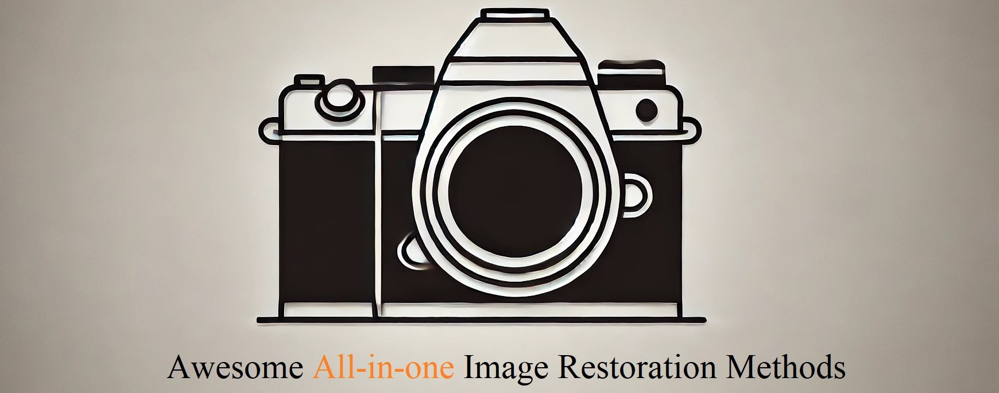

# 😆Awesome-All-in-one-Image-Restoration-Methods

  

## 🎯Purpose
We aim to provide a list of all-in-one image/video processing techniques, including restoration, enhancement, coding, and quality assessment.

**🆕 Always updating...!** We update the newest paper **once a week** and summarize them **at the end of each month**.

**📌 About new works.** If you want to incorporate your studies (e.g., the link of paper or project) on all-in-one image restoration in this repository. Welcome to raise an **issue** or **email us** (jiaqima@whu.edu.cn or zhangx0802@whu.edu.cn). We will incorporate it into this repository and our survey report ASAP. 

<!--     -->

## 🔖 News!!!
- [ ] 2024-xx-xx: **A comprehensive survey is coming soon~**
- [ ] 2024-09-31: **Updated new papers before 31/09/2024.**
- [x] 2024-08-31: **Updated new papers before 31/08/2024.**
- [x] 2024-08-28: **Our paper [Perceive-IR](https://arxiv.org/abs/2408.15994) is on arXiv and under peer review, reach SOTA on all-in-one image restoration tasks.**
- [x] 2024-07-31: **Updated new papers before 31/07/2024.**
- [x] 2024-06-21: **Updated new papers before 21/06/2024.**
- [x] 2024-06-17: **This repo is lauched to better investigate existing all-in-one restoration methods!**
- [x] 2023-06-23: **Our paper [ProRes](https://arxiv.org/abs/2306.13653) is on arXiv and under peer review, nearly the first to introduce visual prompt into all-in-one image restoration tasks.**

## 🌟 Features
- [ ] **Benchmark datasets**
- [ ] **Common-used metrics**
- [ ] **Order rank for papers**
- [x] **All-in-one image restoration**
- [x] **Adverse weather removal**
- [x] **All-in-one video restoration**
- [x] **Other all-in-one related papers**

## 🔠 Abbreviation of degradation

| Degradation type | Guassian nosie | Real Nosie   | Haze/Fog              | Rain             | Raindrop        | Compressed JPEG | 
| :---------------- | :--------------: | :------------: | :---------------------: | :----------------: | :---------------: | :---------------: |
| Abbreviation             | N              | RN           | H/F                   | R                | RD              | J               | 

| Degradation type | Motion blur    | Defocus blur | Low-light/Enhancement | Super-resolution |   Snow |
| :---------------- | :--------------: | :------------: | :---------------------: | :----------------: |  :----: |
| Abbreviation             | B              | DB           | L/E                   | SR               |   S    |

## 📝 Table of contents
<!-- - [Survey paper](#survey-paper)
- [Table of contents](#table-of-contents) -->
- [All-in-one for Natural Image Restoration](#All-in-one-Image-Restoration)
- [All-in-one for Adverse Weather Removal](#Adverse-Weather-Removal)
- [Application in Adverse Weather Conditions](#Application-in-Adverse-Weather-Conditions)
- [All-in-one for Medical Image Restoration](#Medical-Image-Restoration)
- [All-in-one for Document Image Restorationn](#Document-Image-Restoration)
- [All-in-one for LLM-driven Image Restoration](#LLM-driven-Image-Restoration)
- [All-in-one for Question Answering](#Question-Answering)
- [All-in-one for Video Restoration](#Video-Restoration)
- [Benchmark Datasets](#Benchmark-Datasets)
- [Common-used Metrics](#Common-used-Metrics)

<!-- - [All-in-one for Remote Sensing Image Restoration](#image-inpainting)
- [All-in-one for Raw Image Restoration](#image-shadow-removal)
- [All-in-one for Under-water Image Restoration](#image-denoising)
- [All-in-one for Thermal Infrared Image Restoration](#image-dehazing)
- [All-in-one with New Techniques](#image-deblurring) -->

### All in one Image Restoration
| Model | Title |  Task | Venue | Project | Keywords|
| :-- | :---: | :--: | :--: |:--:|:--:|
|DL| [A General Decoupled Learning Framework for Parameterized Image Operators](https://arxiv.org/abs/1907.05852) | N+R+SR+J |ECCV'18 | |parameterized image operators|
|AirNet| [All-in-one image restoration for unknown corruption](https://pengxi.me/wp-content/uploads/2022/03/All-In-One-Image-Restoration-for-Unknown-Corruption.pdf) | N+H+R |CVPR'22 | |Contrastive Learning; Degradation representation|
|GIQE| [Giqe: Generic image quality enhancement via nth order iterative degradation](https://openaccess.thecvf.com/content/CVPR2022/papers/Shyam_GIQE_Generic_Image_Quality_Enhancement_via_Nth_Order_Iterative_Degradation_CVPR_2022_paper.pdf) | H+R+B+E+S+RD |CVPR'22 ||blind distortion combination|
|IDR| [Ingredient-oriented Multi-Degradation Learning for Image Restoration](https://openaccess.thecvf.com/content/CVPR2023/papers/Zhang_Ingredient-Oriented_Multi-Degradation_Learning_for_Image_Restoration_CVPR_2023_paper.pdf) |  N+H+R+B+L |CVPR'23 | |ingredients-oriented; scalable learning |
|PromptIR| [PromptIR: Prompting for All-in-One Blind Image Restoration](https://papers.nips.cc/paper_files/paper/2023/hash/e187897ed7780a579a0d76fd4a35d107-Abstract-Conference.html) | N+H+R |NeurIPS'23 | |prompt-based learning |
|AMIRNet| [All-in-one Multi-degradation Image Restoration Network via Hierarchical Degradation Representation](https://dl.acm.org/doi/abs/10.1145/3581783.3611825) | RN+B+DB+L |ACMMM'23 | |degradation representation; clustering |
|ProRes| [ProRes: Exploring Degradation-aware Visual Prompt for Universal Image Restoration](https://arxiv.org/abs/2306.13653) | RN+R+B+L |arXiv'23.06 | |Degradation-aware Visual Prompts|
|DRM-IR| [DRM-IR: Task-Adaptive Deep Unfolding Network for All-In-One Image Restoration](https://arxiv.org/abs/2307.07688) | H+R+L |arXiv'23.07 | |task adaptive modeling; model-based image restoring|
|AutoDIR| [AutoDIR: Automatic All-in-One Image Restoration with Latent Diffusion](https://arxiv.org/abs/2310.10123) | N+H+R+B+L+RD+SR |arXiv'23.10 | |Blind IQA; latent diffusion|
|NDR-Restore| [Neural Degradation Representation Learning for All-In-One Image Restoration](https://arxiv.org/abs/2310.12848) | N+H+R |arXiv'23.10 | | neural degradation representation|
|PIP| [Prompt-In-Prompt Learning for Universal Image Restoration](https://arxiv.org/abs/2312.05038) | N+H+R/N+H+R+B+L|arXiv'23.12 | |Degradation-aware and basic prompts  |
|TextPromptIR| [Textual Prompt Guided Image Restoration](https://arxiv.org/abs/2312.06162) |N+H+R |arXiv'23.12 | | textual prompt; Blind IR |
|Restornet| [Restornet: An efficient network for multiple degradation image restoration](https://www.sciencedirect.com/science/article/pii/S0950705123008663) |N+H+R  |KBS'24 | |degradation-specific contrastive loss |
|CAPTNet| [Prompt-based Ingredient-Oriented All-in-One Image Restoration](https://ieeexplore.ieee.org/abstract/document/10526271) | N+H+R+B |TCSVT'24 | |visual prompt  |
|TextualDegRemoval| [Improving Image Restoration through Removing Degradations in Textual Representations](https://openaccess.thecvf.com/content/CVPR2024/html/Lin_Improving_Image_Restoration_through_Removing_Degradations_in_Textual_Representations_CVPR_2024_paper.html) | N+H+R |CVPR'24 | |image-to-text mapper; T2I |
|MPerceiver| [Multimodal Prompt Perceiver: Empower Adaptiveness Generalizability and Fidelity for All-in-One Image Restoration](https://openaccess.thecvf.com/content/CVPR2024/html/Ai_Multimodal_Prompt_Perceiver_Empower_Adaptiveness_Generalizability_and_Fidelity_for_All-in-One_CVPR_2024_paper.html) | N+H+RN+R+RD+B+RB+L+S  |CVPR'24 | |multimodal prompt; diffusion priors |
|DiffUIR| [Selective Hourglass Mapping for Universal Image Restoration Based on Diffusion Model](https://openaccess.thecvf.com/content/CVPR2024/html/Zheng_Selective_Hourglass_Mapping_for_Universal_Image_Restoration_Based_on_Diffusion_CVPR_2024_paper.html) | H+R+B+L+S |CVPR'24 | |selective hourglass mapping; Diffusion|
|InstructIR| [InstructIR: High-Quality Image Restoration Following Human Instructions](https://arxiv.org/abs/2401.16468) | N+H+R/N+H+R+B+L+(SR+E) |ECCV'24 | |human-written instruction; text-guidance|
|RAM| [Restore Anything with Masks: Leveraging Mask Image Modeling for Blind All-in-One Image Restoration]() |  |ECCV'24 | | |
|GRIDS| [GRIDS: Grouped Multiple-Degradation Restoration with Image Degradation Similarity](https://arxiv.org/abs/2407.12273) | 11 degradation types|ECCV'24 | | multiple degradation relationships|
|UniProcessor| [UniProcessor: A Text-induced Unified Low-level Image Processor](https://arxiv.org/abs/2407.20928) | 30 degradation types |ECCV'24 | |subject/manipulation prompt |
|MiOIR| [Towards Effective Multiple-in-One Image Restoration: A Sequential and Prompt Learning Strategy](https://arxiv.org/abs/2401.03379) | N+H+R+B+L+SR+J |arXiv'24.01 | |sequential/prompt learning|
|U-WADN| [Unified-Width Adaptive Dynamic Network for All-In-One Image Restoration](https://arxiv.org/abs/2401.13221) | N+H+R |arXiv'24.01 | |Width Adaptive Backbone/Selector|
|AdaIR| [AdaIR: Adaptive All-in-One Image Restoration via Frequency Mining and Modulation](https://arxiv.org/abs/2403.14614) | N+H+R/N+H+R+B+L |arXiv'24.03 | |frequency mining/modulation|
|DyNet| [Dynamic Pre-training: Towards Efficient and Scalable All-in-One Image Restoration](https://arxiv.org/abs/2404.02154) | N+H+R |arXiv'24.04 | |weight-sharing; Dynamic Pre-training |
|AdaIR| [AdaIR: Exploiting Underlying Similarities of Image Restoration Tasks with Adapters](https://arxiv.org/abs/2404.11475) | N+R+B |arXiv'24.04 | | self-supervised pre-training|
|DaAIR| [Efficient Degradation-aware Any Image Restoration](https://arxiv.org/abs/2405.15475) | N+H+R/N+H+R+B+L |arXiv'24.05 | | Degradation-aware Learner;  low-rank regime|
|LM4LV| [LM4LV: A Frozen Large Language Model for Low-level Vision Tasks](https://arxiv.org/abs/2405.15734) | N+R+B |arXiv'24.05 | |Frozen Large Language Model|
|ConStyle v2| [ConStyle v2: A Strong Prompter for All-in-One Image Restoration](https://arxiv.org/abs/2406.18242) | N+H+R+B+DB+L+S+J |arXiv'24.06 | |prompter; pre-training|
|Diff-Restorer| [Diff-Restorer: Unleashing Visual Prompts for Diffusion-based Universal Image Restoration](https://arxiv.org/abs/2407.03636) |N+RD+B+S+J  |arXiv'24.07 | |VLM; SD |
|Instruct-IPT| [Instruct-IPT: All-in-One Image Processing Transformer via Weight Modulation](https://export.arxiv.org/abs/2407.00676) | N+H+R+B+S |arXiv'24.07 | | low-rank decomposited |
|LMDIR| [Training-Free Large Model Priors for Multiple-in-One Image Restoration](https://arxiv.org/abs/2407.13181v1) | N+R+L |arXiv'24.07 | | Large Model Driven |
|AnyIR| [Any Image Restoration with Efficient Automatic Degradation Adaptation](https://arxiv.org/abs/2407.13372v1) | N+H+R/N+H+R+B+L |arXiv'24.07 | |local-global gated intertwining |
|MEASNet| [Multi-Expert Adaptive Selection: Task-Balancing for All-in-One Image Restoration](https://arxiv.org/abs/2407.19139) | N+H+R/N+H+R+B+L |arXiv'24.07 | |multi-expert adaptive selection |
|ColorRA| [Contribution-based Low-Rank Adaptation with Pre-training Model for Real Image Restoration](https://arxiv.org/abs/2408.01099) | N+H+R+RD+B |ECCV'24 ||low-rank adaptation|
|HAIR| [HAIR: Hypernetworks-based All-in-One Image Restoration](https://arxiv.org/abs/2408.08091) | N+H+R/N+H+R+B+L |arXiv'24.08 | |Classifier/Hyper Selecting|
|BIR-D| [Taming Generative Diffusion for Universal Blind Image Restoration](https://arxiv.org/abs/2408.11287v1) | More than 9 degradations |arXiv'24.08 | |Blind method; diffusion|

<!-- | | [All-in-One Image Dehazing Based on Attention Mechanism](https://link.springer.com/chapter/10.1007/978-981-99-6486-4_5) | Qingyue Dai |Natrual Image |ICIRA 2023 | | -->

<!-- 
| |  |   |Natrual Image |arXiv 2024 | | -->

### Adverse Weather Removal
| Model | Title | Task | Venue | Project | Method |
| :-- | :---: | :--: |:--:|:--:|:--:|
|All-in-one| [All in One Bad Weather Removal using Architectural Search](https://openaccess.thecvf.com/content_CVPR_2020/papers/Li_All_in_One_Bad_Weather_Removal_Using_Architectural_Search_CVPR_2020_paper.pdf) | R+RD+H+S |CVPR'20 | | NAS; Shared decoder |
|TKL|[Learning Multiple Adverse Weather Removal via Two-stage Knowledge Learning and Multi-contrastive Regularization: Toward a Unified Model](https://arxiv.org/abs/2104.14951) | | CVPR'22 |  | |
|TransWeather| [TransWeather: Transformer-based Restoration of Images Degraded by Adverse Weather Conditions](https://openaccess.thecvf.com/content/CVPR2022/papers/Valanarasu_TransWeather_Transformer-Based_Restoration_of_Images_Degraded_by_Adverse_Weather_Conditions_CVPR_2022_paper.pdf) | R+RD+H+S|CVPR'22| | Transformer model; Weather type queries||
|BIDeN| [Blind Image Decomposition](https://arxiv.org/abs/2108.11364) | R+RD+H+S |ECCV'22||Multi-scale encoder; GANs |
|UVRNet| [Unified Multi-Weather Visibility Restoration](https://ieeexplore.ieee.org/stamp/stamp.jsp?tp=&arnumber=9966834) |  |TMM'22|| |
|AIRFormer| [Frequency-Oriented Efficient Transformer for All-in-One Weather-Degraded Image Restoration](https://ieeexplore.ieee.org/stamp/stamp.jsp?tp=&arnumber=10196308) |  |TCSVT'23|| |
|WeatherDiffusion| [Restoring Vision in Adverse Weather Conditions with Patch-Based Denoising Diffusion Models](https://doi.org/10.1109/TPAMI.2023.3238179) | R+RD+H+S |TPAMI'23 | | Patch-based diffusion model|
|TOENet| [Let You See in Haze and Sandstorm: Two-in-One Low-Visibility Enhancement Network](https://ieeexplore.ieee.org/abstract/document/10216344) |  |TIM'23 | | |
|ADMS| [All-in-one Image Restoration for Unknown Degradations Using Adaptive Discriminative Filters for Specific Degradations](https://openaccess.thecvf.com/content/CVPR2023/papers/Park_All-in-One_Image_Restoration_for_Unknown_Degradations_Using_Adaptive_Discriminative_Filters_CVPR_2023_paper.pdf) | R+N+B/R+S+H |CVPR'23 | | |
|SmartAssign| [SmartAssign: Learning A Smart Knowledge Assignment Strategy for Deraining and Desnowing](https://openaccess.thecvf.com/content/CVPR2023/papers/Wang_SmartAssign_Learning_a_Smart_Knowledge_Assignment_Strategy_for_Deraining_and_CVPR_2023_paper.pdf) | R+S |CVPR'23 | | |
|WGWS-Net| [Learning Weather-General and Weather-Specific Features for Image Restoration Under Multiple Adverse Weather Conditions](https://openaccess.thecvf.com/content/CVPR2023/papers/Zhu_Learning_Weather-General_and_Weather-Specific_Features_for_Image_Restoration_Under_Multiple_CVPR_2023_paper.pdf) | R+RD+H/R+S+H |CVPR'23 | | |
|WeatherStream| [WeatherStream: Light Transport Automation of Single Image Deweathering](https://openaccess.thecvf.com/content/CVPR2023/papers/Zhang_WeatherStream_Light_Transport_Automation_of_Single_Image_Deweathering_CVPR_2023_paper.pdf) | R+F+S |CVPR'23 | | |
|RAHC| [Learning to Restore Arbitrary Hybrid Adverse Weather Conditions in One Go](https://arxiv.org/abs/2305.09996) |  |arXiv'23.05 | ||
|WM-MoE| [WM-MoE: Weather-aware Multi-scale Mixture-of-Experts for Blind Adverse Weather Removal](https://arxiv.org/abs/2303.13739v2) |  |arXiv 2023 | ||
|MetaWeather| [MetaWeather: Few-Shot Weather-Degraded Image Restoration](https://arxiv.org/abs/2308.14334) | R+D+S+H_M  |ECCV'24 | | meta-learning framework|  
|UtilityIR| [Always Clear Days: Degradation Type and Severity Aware All-In-One Adverse Weather Removal](https://arxiv.org/abs/2310.18293) |R+RD+H+S  |arXiv'23 | |Marginal Quality Ranking Loss |
|DDCNet| [Decoupling Degradation and Content Processing for Adverse Weather Image Restoration](https://arxiv.org/abs/2312.05006) |  |arXiv'23.12 | | |
|DwGN| [Image All-In-One Adverse Weather Removal via Dynamic Model Weights Generation](https://papers.ssrn.com/sol3/papers.cfm?abstract_id=4656641) |  |KBS'24 | | |
|DTMWR| [Multi-weather Image Restoration via Domain Translation](https://openaccess.thecvf.com/content/ICCV2023/papers/Patil_Multi-weather_Image_Restoration_via_Domain_Translation_ICCV_2023_paper.pdf) | H+R+S |ICCV'23 | |domain-translation |
|AWRCP| [Adverse Weather Removal with Codebook Priors](https://openaccess.thecvf.com/content/ICCV2023/papers/Ye_Adverse_Weather_Removal_with_Codebook_Priors_ICCV_2023_paper.pdf) |  |ICCV'23 | | |
|ViWS-Net| [Video Adverse-Weather-Component Suppression Network via Weather Messenger and Adversarial Backpropagation](https://openaccess.thecvf.com/content/ICCV2023/papers/Yang_Video_Adverse-Weather-Component_Suppression_Network_via_Weather_Messenger_and_Adversarial_Backpropagation_ICCV_2023_paper.pdf) | |ICCV'23 | ||
|GridFormer| [GridFormer: Residual Dense Transformer with Grid Structure for Image Restoration in Adverse Weather Conditions](https://arxiv.org/abs/2305.17863) | R+RD+H+S |IJCV'24 | | Grid structure based transformer model| 
|CLIP-SRD| [Exploring the Application of Large-scale Pre-trained Models on Adverse Weather Removal](https://ieeexplore.ieee.org/stamp/stamp.jsp?tp=&arnumber=10453462) |  |TIP'24 | | |
|DeformDeweatherNet| [Residual Deformable Convolution for better image de-weathering](https://www.sciencedirect.com/science/article/pii/S0031320323007902) | |PR'24 | | |
|CL_all-in-one| [Continual All-in-One Adverse Weather Removal with Knowledge Replay on a Unified Network Structure](https://ieeexplore.ieee.org/document/10473168) |H+R+S  |TMM'24 | |continual learning; knowledge distillation |
|MPDAC | [Multiple Adverse Weather Removal Using Masked-Based Pre-Training and Dual-Pooling Adaptive Convolution](https://ieeexplore.ieee.org/document/10506517) | |Access'24 | | |
|MoFME| [Efficient Deweather Mixture-of-Experts with Uncertainty-aware Feature-wise Linear Modulation](https://arxiv.org/abs/2312.16610) | R+RD+S |AAAI'24 | |MoE architecture |
|Imperfect-deweathering| [Learning Real-World Image De-Weathering with Imperfect Supervision](https://arxiv.org/abs/2310.14958) |H+R+S  |AAAI'24 | |Consistent Label Constructor |
|DiffTTA| [Genuine Knowledge from Practice: Diffusion Test-Time Adaptation for Video Adverse Weather Removal](https://openaccess.thecvf.com/content/CVPR2024/papers/Yang_Genuine_Knowledge_from_Practice_Diffusion_Test-Time_Adaptation_for_Video_Adverse_CVPR_2024_paper.pdf) | |CVPR'24 || Video |
|LDR| [Language-driven All-in-one Adverse Weather Removal](https://openaccess.thecvf.com/content/CVPR2024/papers/Yang_Language-driven_All-in-one_Adverse_Weather_Removal_CVPR_2024_paper.pdf) |  |CVPR'24 || |
|AoSRNet| [AoSRNet: All-in-One Scene Recovery Networks via Multi-knowledge Integration](https://arxiv.org/abs/2402.03738) | |KBS'24 | | |
|AiOENet| [AiOENet: All-in-One Low-Visibility Enhancement to Improve Visual Perception for Intelligent Marine Vehicles Under Severe Weather Conditions](https://ieeexplore.ieee.org/abstract/document/10375786) |  |TIV'24 | | |
|JCDM| [Joint Conditional Diffusion Model for Image Restoration with Mixed Degradations](https://arxiv.org/abs/2404.07770) | R+RD+H+S  |arXiv'24.04 | |Physical model guidance; Diffusion Model |
|Histoformer| [Restoring Images in Adverse Weather Conditions via Histogram Transformer](https://arxiv.org/abs/2407.10172) | R+RD+H+S  |ECCV'24 | | Histogram self-attention|
|OneRestore| [OneRestore: A Universal Restoration Framework for Composite Degradation](https://arxiv.org/abs/2407.04621) | R+H+S+L  |ECCV'24 | | cross-attention; scene descriptors|
|WResVLM| [Towards Real-World Adverse Weather Image Restoration: Enhancing Clearness and Semantics with Vision-Language Models](https://arxiv.org/abs/2409.02101v1) | R+RD+H+S  |ECCV'24 | | semi-supervised; vision-language model |
|T3-DiffWeather| [Teaching Tailored to Talent: Adverse Weather Restoration via Prompt Pool and Depth-Anything Constraint](https://arxiv.org/abs/2409.02101v1) | R+RD+H+S  |ECCV'24 | |weather-prompts; general prompts; Depth-Anything feature|
|AWRaCLe| [AWRaCLe: All-Weather Image Restoration using Visual In-Context Learning](https://arxiv.org/abs/2409.00263) | R+H+S  |arXiv'24.09 | |CLIP; visual context information |
|AllWeather-Net|[AllWeather-Net: Unified Image Enhancement for Autonomous Driving Under Adverse Weather and Low-Light Conditions](https://arxiv.org/abs/2409.02045) | R+RD+H+S  |arXiv'24.09 || knowledge distillation; Scaled Illumination-aware Attention |
|D4IR|[Data-free Distillation with Degradation-prompt Diffusion for Multi-weather Image Restoration](https://arxiv.org/abs/2409.03455) | R+H+S  |arXiv'24.09 || hierarchical architecture; diffusion model |

### Application in Adverse Weather Conditions
| Model | Title | First Author | Type | Venue | Project |
| :-- | :---: | :--: | :--: |:--:|:--:|
|WAS| [Semantic Segmentation under Adverse Conditions: A Weather and Nighttime-aware Synthetic Data-based Approach](https://arxiv.org/abs/2210.05626) | Abdulrahman Kerim | Image |BMVC 2022 | |
|ROD-Weather| [Robust Object Detection in Challenging Weather Conditions](https://openaccess.thecvf.com/content/WACV2024/papers/Gupta_Robust_Object_Detection_in_Challenging_Weather_Conditions_WACV_2024_paper.pdf) | Himanshu Gupta | Image |WACV 2024 | |
|IDD-AW| [IDD-AW: A Benchmark for Safe and Robust Segmentation of Drive Scenes in Unstructured Traffic and Adverse Weather](https://iddaw.github.io/static/pdfs/IDDAW_WACV24_final.pdf) | Furqan Ahmed Shaik | Image |WACV 2024 | |
|SD4VS| [Leveraging Synthetic Data to Learn Video Stabilization Under Adverse Conditions](https://openaccess.thecvf.com/content/WACV2024/papers/Kerim_Leveraging_Synthetic_Data_To_Learn_Video_Stabilization_Under_Adverse_Conditions_WACV_2024_paper.pdf) | Abdulrahman Kerim | Video Stabilization |WACV 2024 | |
|CFMW| [CFMW: Cross-modality Fusion Mamba for Multispectral Object Detection under Adverse Weather Conditions](https://arxiv.org/abs/2404.16302) | Haoyuan Li | Image |arXiv 2024 | |
|ControlUDA| [ControlUDA: Controllable Diffusion-assisted Unsupervised Domain Adaptation for Cross-Weather Semantic Segmentation](https://arxiv.org/abs/2402.06446) | Fengyi Shen | Image |arXiv 2024 | |
|DKR| [Semantic Segmentation in Multiple Adverse Weather Conditions with Domain Knowledge Retention](https://arxiv.org/abs/2401.07459) | Xin Yang | Image |AAAI 2024 ||
|PASS| [Parsing All Adverse Scenes: Severity-Aware Semantic Segmentation with Mask-Enhanced Cross-Domain Consistency](https://ojs.aaai.org/index.php/AAAI/article/view/29251) | Fuhao Li | Semantic Segmentation |AAAI 2024 ||
|Vehicle-weather| [Perception and sensing for autonomous vehicles under adverse weather conditions: A survey](https://www.sciencedirect.com/science/article/pii/S0924271622003367) | Yuxiao Zhang | Survey |ISPRS JPRS 2023 | |
|Fire-Detection| [An Effective Attention-based CNN Model for Fire Detection in Adverse Weather Conditions](https://www.sciencedirect.com/science/article/pii/S0924271623002940) | Hikmat Yar | Fire-Detection |ISPRS JPRS 2023 | |
|SDRNet| [SDRNet: Saliency-Guided Dynamic Restoration Network for Rain and Haze Removal in Nighttime Images](https://ieeexplore.ieee.org/abstract/document/10447635) | Wanning Zhu | Image |ICASSP 2024 | |
|SeaIceWeather| [Deep Learning Strategies for Analysis of Weather-Degraded Optical Sea Ice Images]( ) | Nabil Panchi |Natrual Image |IEEE Sensors Journal 2024 | |
|PLAIR-AW| [Power Line Aerial Image Restoration under Adverse Weather: Datasets and Baselines](https://arxiv.org/abs/2409.04812) | Sai Yang | Image | arXiv 2024 |  |

### Medical Image Restoration
| Model | Title | First Author | Type | Venue | Project |
| :-- | :---: | :--: | :--: |:--:|:--:|
|AMIR| [All-In-One Medical Image Restoration via Task-Adaptive Routing](https://arxiv.org/html/2405.19769v1) | Zhiwen Yang | Medical Image |MICCAI 2024 | |
|ProCT| [Universal Incomplete-View CT Reconstruction with Prompted Contextual Transformer](https://arxiv.org/abs/2312.07846) | Chenglong Ma |Medical Image |arXiv 2023 | |

### Document Image Restoration
| Model | Title | First Author | Type | Venue | Project |
| :-- | :---: | :--: | :--: |:--:|:--:|
|DocRes| [DocRes: A Generalist Model Toward Unifying Document Image Restoration Tasks](https://openaccess.thecvf.com/content/CVPR2024/html/Zhang_DocRes_A_Generalist_Model_Toward_Unifying_Document_Image_Restoration_Tasks_CVPR_2024_paper.html) | Jiaxin Zhang |Document Image |CVPR 2024| |

### Parameter adaptation Image Restoration
| Model | Title |  Type | Venue | Project |Method|
| :-- | :---: | :--: | :--: |:--:|:--:|
|AdaptIR| [AdaptIR: Parameter Efficient Multi-task Adaptation for Pre-trained Image Restoration Models](https://arxiv.org/abs/2312.08881) | Natrual Image |arXiv'23.12 | |parameter efficient transfer learning |

### LLM-driven Image Restoration
| Model | Title | First Author | Type | Venue | Project |
| :-- | :---: | :--: | :--: |:--:|:--:|
|InstructIR| [InstructIR: High-Quality Image Restoration Following Human Instructions](https://arxiv.org/abs/2401.16468) | Marcos V. Conde |Natrual Image |ECCV 2024 | |
|LM4LV| [LM4LV: A Frozen Large Language Model for Low-level Vision Tasks](https://arxiv.org/abs/2405.15734) | Boyang Zheng |Natrual Image |arXiv 2024 | |
|DACLIP-UIR| [Controlling vision-language models for universal image restoration](https://arxiv.org/abs/2310.01018) | Boyang Zheng |Natrual Image |arXiv 2024 | |

### Question Answering
| Model | Title | First Author | Type | Venue | Project |
| :-- | :---: | :--: | :--: |:--:|:--:|
|PromptGIP| [Unifying Image Processing as Visual Prompting Question Answering](https://arxiv.org/abs/2310.10513) | Yihao Liu |Natrual Image |arXiv 2023| |

### Video Restoration
| Model | Title | First Author | Type | Venue | Project |
| :-- | :---: | :--: | :--: |:--:|:--:|
|CDUN| [Degradation Conditions Guided Cross-Consistent Deep Unfolding Network for All-In-One Video Restoration](https://arxiv.org/abs/2309.01627) | Yuanshuo Cheng | AIO | arXiv 2023 |  |
|DiffTTA| [Genuine Knowledge from Practice: Diffusion Test-Time Adaptation for Video Adverse Weather Removal](https://openaccess.thecvf.com/content/CVPR2024/papers/Yang_Genuine_Knowledge_from_Practice_Diffusion_Test-Time_Adaptation_for_Video_Adverse_CVPR_2024_paper.pdf) | Yijun Yang | Adverse weather |CVPR'24 ||
|SD4VS| [Leveraging Synthetic Data to Learn Video Stabilization Under Adverse Conditions](https://openaccess.thecvf.com/content/WACV2024/papers/Kerim_Leveraging_Synthetic_Data_To_Learn_Video_Stabilization_Under_Adverse_Conditions_WACV_2024_paper.pdf) | Abdulrahman Kerim | Video stabilization |WACV 2024 | |
|ViWS-Net| [Video Adverse-Weather-Component Suppression Network via Weather Messenger and Adversarial Backpropagation](https://openaccess.thecvf.com/content/ICCV2023/papers/Yang_Video_Adverse-Weather-Component_Suppression_Network_via_Weather_Messenger_and_Adversarial_Backpropagation_ICCV_2023_paper.pdf) | Yijun Yang | Adverse weather |ICCV'23 | ||

### Degradation Forgetting
| Model | Title | First Author | Type | Venue | Project |
| :-- | :---: | :--: | :--: |:--:|:--:|
|OD| [Accurate Forgetting for All-in-One Image Restoration Model](https://arxiv.org/abs/2409.00685) | Xin Su | Degradation Forgetting | arXiv 2024 |  |

### Benchmark Datasets (Multi-Weather)
|Dataset|Task|Usage|Link|Year|
|:----:|:----:|:----:|:----:|:----:|
|[Raindrop](https://openaccess.thecvf.com/content_cvpr_2018/papers_backup/Qian_Attentive_Generative_Adversarial_CVPR_2018_paper.pdf) |raindrop|Train: 861/Test: set-A (58), set-B (239)|  [download](https://drive.google.com/drive/folders/1e7R76s6vwUJxILOcAsthgDLPSnOrQ49K) |CVPR 2018|
|[Snow100K](https://ieeexplore.ieee.org/document/8291596) |snow| 100K synthetic images|  [download](https://sites.google.com/view/yunfuliu/desnownet) |IEEE TIP 2018|
|[Outdoor-Rain](https://openaccess.thecvf.com/content_CVPR_2019/papers/Li_Heavy_Rain_Image_Restoration_Integrating_Physics_Model_and_Conditional_Adversarial_CVPR_2019_paper.pdf) |haze & rain| 9000 train/1500 val|  [download](https://www.dropbox.com/scl/fo/3c7wutxxmnvd4pwyiwvk8/AM3FAJcvKImc-rgaRUBhr5Q?rlkey=16vbvckaeg9wwk20fww8s9ubd&e=1&dl=0) |CVPR 2019|
|[ALL-Weather](https://openaccess.thecvf.com/content/CVPR2022/papers/Valanarasu_TransWeather_Transformer-Based_Restoration_of_Images_Degraded_by_Adverse_Weather_Conditions_CVPR_2022_paper.pdf)|haze & rain/snow/raindrop|Train (18069): Outdoor-Rain (8250), Snow100K (9001), and Raindrop (818)/Test: Snow100K-L (16801), RaindropA (58), Outdoor-Rain (750)|[download](https://drive.google.com/file/d/1tfeBnjZX1wIhIFPl6HOzzOKOyo0GdGHl/view)|CVPR 2022|
|[Flickr2K]()|Image Super-resolution|Training||2017|
|[SeaIceWeather ](https://ieee-dataport.org/documents/seaiceweather)|Image De-weathering|Training,Testing||2024|

### Benchmark Datasets (Distortion) Working In Progress!
|Dataset|Task|Usage|Year|
|:----:|:----:|:----:|:----:|
|[DIV2K](https://data.vision.ee.ethz.ch/cvl/DIV2K)|Image Super-resolution|Training,Testing|2017|
|[Flickr2K](https://www.kaggle.com/datasets/daehoyang/flickr2k)|Image Super-resolution|Training|2017|
|[SeaIceWeather ](https://ieee-dataport.org/documents/seaiceweather)|Image De-weathering|Training,Testing|2024|

### Common-used Metrics Working In Progress!

<!-- # Diffusion model-based Image quality assessment
|Model| Paper | First Author | Venue | Topic | Project |
| :--- | :---: | :---: | :--: | :--: |:--: |
|DifFIQA| [DifFIQA: Face Image Quality Assessment Using Denoising Diffusion Probabilistic Models](https://arxiv.org/abs/2305.05768) | Žiga Babnik | Preprint'23 | Image quality assessment | |
|PFD-IQA| [Feature Denoising Diffusion Model for Blind Image Quality Assessment](https://arxiv.org/abs/2401.11949) | Xudong Li | Preprint'24 | Image quality assessment | | -->

## 🤝 Cite us
WIP!

